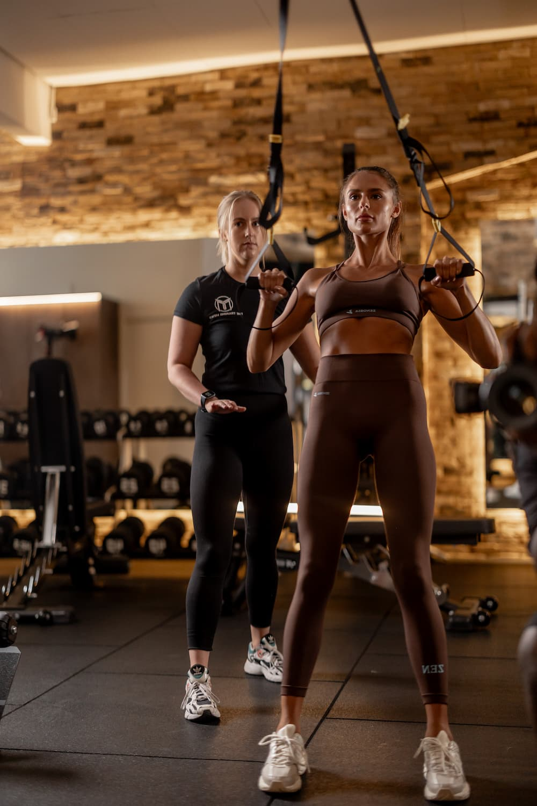

## Strength and conditioning

Strength and conditioning is vital for everyone. This could be specific strength training for a sport or to get back on track after an injury or an operation.

### Sport related benefits

* Better performance 
* Reduced injury risk
* Improved speed and fitness
* Improved joint strength

### Post injury or surgery benefits 

* Faster recovery
* Reduced chance of further injuries
* Improved mobility and functionality
* Enhanced general fitness

### The Training Mews Approach

We create bespoke programmes which include a variety of training disciplines. We will set achievable and realistic goals to meet the needs of the individual. 

We have worked with professional athletes from a range of sports including football, rugby, polo and motor racing.

We have worked with professional athletes from a range of sports including football, rugby, polo and motor racing.

Weight lifting is the most common form considered for strength and conditioning. However it takes a variety of training approaches to fully realise an individual’s training potential: 
* Mobility 
* Plyometrics
* Injury history 
* Diet and nutrition
* Body composition
* Muscular endurance
* Cardiovascular endurance 
* Muscular strength 

All of these elements will be assessed and analysed when creating a customised programme.  

We will improve your strength, mobility, power and speed through a carefully designed training regime personalised to your needs.

