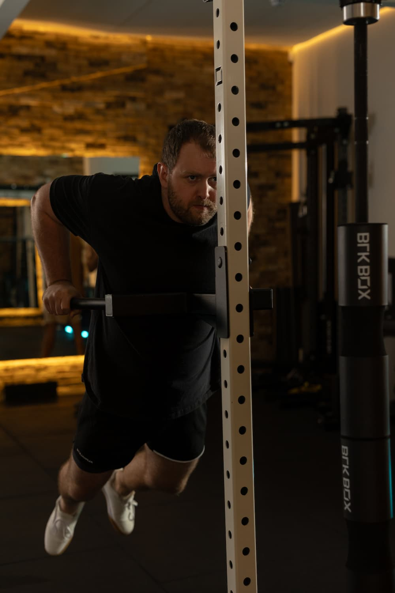

## Weight management

### Why is it so important?

Weight management is often a reason someone start’s training but the benefits go further than just looking and feeling better. At the Training Mews we use a scientific and study based approach to ensure you are on the best path for your weight management and overall health.

### Physical and mental health benefits

Achieving and maintaining a healthy weight has a range of benefits to boost your overall physical and mental wellbeing.

Physical benefits include:
* reduce the risk of cardiovascular disease, type 2 diabetes and cancer
* increase energy levels and libido 
* build better posture
* enhance mobility
* improve sleep.

Mental health benefits include:
* increase endorphins
* improve confidence and self esteem
* reduce anxiety 
* build a sense of accomplishment
* feel happier.

### What can we do to help?

At the Training Mews every new client will receive a full assessment. As well as physical parameters we also cover current eating habits, nutrition, stress levels and sleep patterns.

From there we create a customised plan best suited to your requirements, with clear and continuous guidance as to how to achieve and maintain your goals. 

We understand that sometimes staying on track can be difficult. We are dedicated to supporting you and we’ll encourage and advise along your journey whenever you need it.

